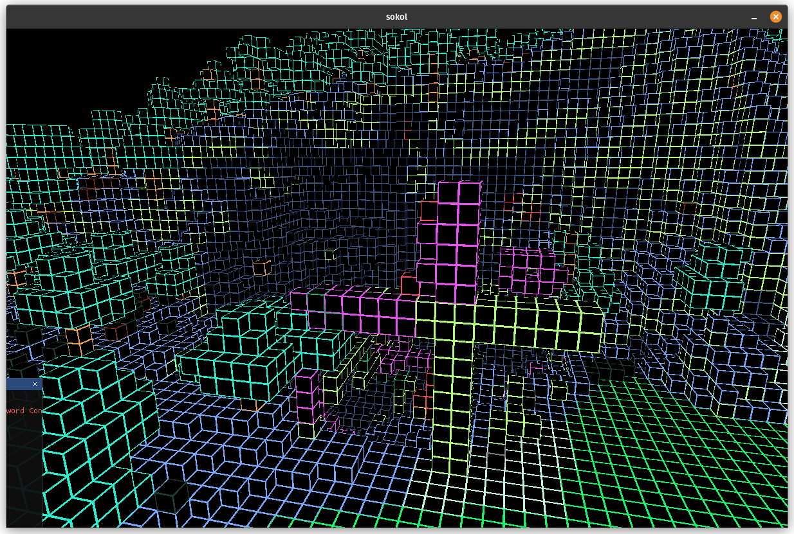

# Goals
- learn how to better structure event loops with networking.
- try to use 3dpga instead of matrices to see how well it works.

# Non goals
- make is super optimized
- support anything other than 1.5.2 minecraft

For minecraft client to work properly and not be rejected by server it needs to handle physics the way server wants. Im not really sure how server wants physics to function so im stuck a bit.

